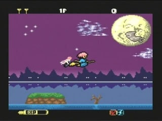
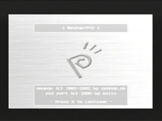
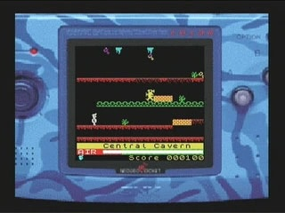

# NeoPop/PS2 : Emulator as in Dreamland

Neopop/Ps2 is a port of Neopop, a portable "NeoGeo Pocket (Color)" emulator.

### Disclaimer

NeoPop/PS2 is not endorsed by SNK Playmore in any way and is produced without the use of any copyrighted material which belongs to Sony Computer Entertainment Inc, or SNK Playmore, or any other party. In addition you agree that you will not distribute this program with commercial rom images in any form.

The NeoPop/PS2 source code is distributed under the terms of the GNU General Public License.

### History

* v0.10 (12/03/2005)
  - first public release
  - based on NeoPop Core version 0.71

### Current Features:
- High compatibilty (identical to the original)
- PAL/NTSC auto-detection
- HOST/CD/MC/HDD support
- Loads games from everywhere !
- Ingame menu

### Current Issues:
- emulation is not fullspeed
- Sound Issues (due to slow emulation speed)
- GUI/browser is bugged

### To-do list:
- Improve speed
- Zip Support
- Flash Support
- Save State
- Screenshot support (in the rom browser)
- more ?

### Usage:

#### General requirements :

Supported roms extension are :
  *.ngp
  *.ngc
  *.npc

CDROM/MC :
  - Put your roms in a directory at the root of you CD / MC
  - Burn it (if on CD)
  - Launch the emu, it's done !
  
  -> filename are limited to 32 characters on the MC (including extension)

HDD
  - Create a valid partition with a filesystem where to put your roms
  - Copy them into it (be sure to put them in the root directly)
  - Launch the emu, select [HDD] in the browser 
  - Enjoy !
  
HOST :
  The emulator can load rom from host, in order to use this, put a file
  named "romlist.ini" where is located the elf and containing :
  
  directory\filename1.ngp;
  directory\filename2.ngp;
  directory\filename3.ngp;
  ...
  
  according to where you put your roms.
  
  for example  :
  
  PDroms\Manic Miner V1.0 by Lindon Dodd (PD).npc;
  PDroms\packman.ngp;

  etc...
    
  in the above examples the roms will need to be located under a "PDroms" directory, respecting to where the elf is located.
  so :
  
  \PDroms\Manic Miner V1.0 by Lindon Dodd (PD).npc
  \PDroms\packman.ngp
  \romlist.ini
  \neopop.elf  
  
  
##### note :
- When using host loading you won't have access to your mc/cd/hdd
- HDD is only available if you have a HDD installed and formatted.
- the Browser only support one level directory
- With HDD, the roms need to located in the root of your partition. Partition must be valid and created with a filesystem
- There is some problem with refreshing CD content when changing CD in the browser (just choose the old one / back and it should force refresh)
- The browser won't enter a directory/partition if it doesn't find any rom inside (should add a warning msg).

The rom browser will allow you to switch from mc/cdrom/hdd to mc/cdrom/hdd ..  
 

### In-game controls:

Arrows      =     A/D-Pad
Left stick  =     A/D-Pad
Cross	    =    Button A
Circle      =    Button B
Square      =    Button C
Start       =       Start
Select      = Ingame Menu

### In-game Menu:

- Resume      : Go back to current game
- Display     : Change the display (original size, double, fullscreen)
- Filter      : Video filter (Nearest or Linear)
	        with certain games, Linear filter is needed to correct 
	        some effect caused by the fullscreen video option.
- FPS Counter : Display the framerate
	        note that FPS is NOT accurate when frameskip is ON
- Frameskip   : Enable / Disable frameskip
	        It enable a frameskip of 1, that is more than enough.
- Sound	      : Turn sound on/off
- Soft Reset  : Reset emulation
- Browser     : return to the rom browser

Additionaly by holding [Select] when in the ingame menu, you can change 
the screen position using the directional pad.

### Credits: (in no particular order)

neopop_uk, For the neopop emulator, please see original readme for full original credits.
7not6, For his precious help on debugging the cpu cores
Drakonite, triple buffering idea, and lots of talk ;)
<G>, GUI background/artwork.
CC Team, for support and sponsoring.
Hyriu, LibCDVD.
Vzzrzzn, Sjeep, GfxPipe lib.
Sjeep, Lukasz Bruun, Original (i)Sjpcm lib.
PS2-Scene, For hosting
PS2DEV, As all this won't be possible without the PS2SDK !
Everyone Else, Thanks for taking an interest....